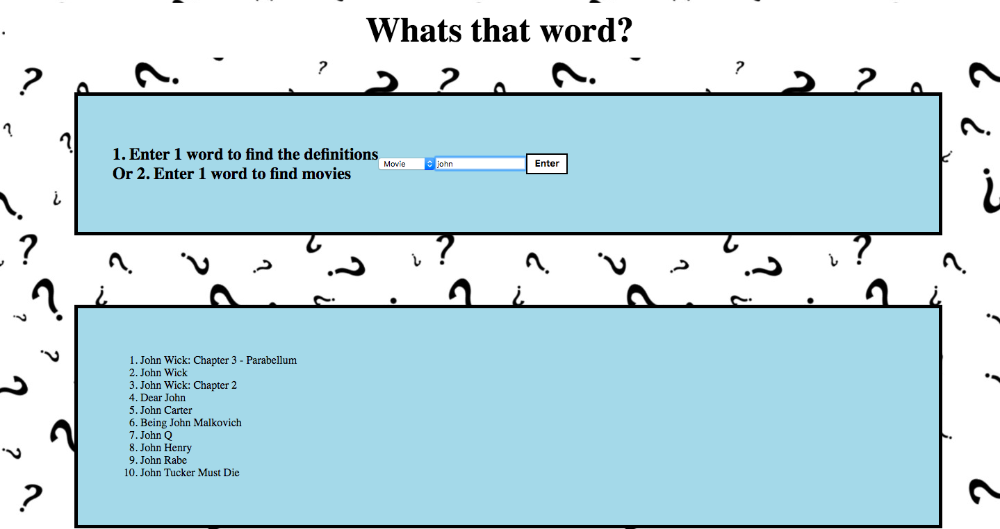

## Description
For this project I used different API's available as public web services. I used the Fetch API
to asynchronously request and process response data on my website. There is text box that the user can input 1 word and choose whether they would like a definition a movie title. Retrieving the list of the top 10 results of the search

### APIs Used

* Webster-Merriam Dictionary/Thesaurus APIs (requires API key)
* Movie DB API (requires API key)

